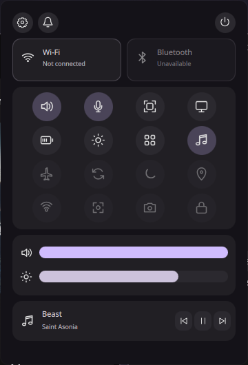
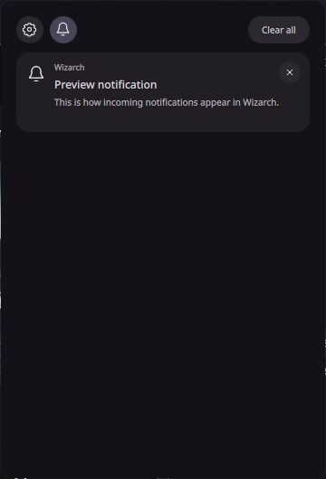
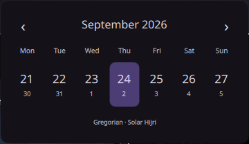
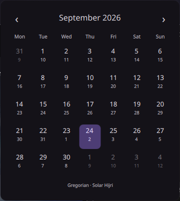
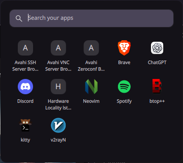

# Wizarch

A compact desktop shell for Arch Linux, Hyprland, and Quickshell. One floating pill opens an app launcher, calendar, quick settings, theme picker, and a titleless notification center. Wizarch uses flat Material-inspired surfaces and a custom wizard-hat mark.

<p align="center"></p>

## Screenshots

| Quick settings | Notifications |
| --- | --- |
|  |  |

| Calendar · week | Calendar · month |
| --- | --- |
|  |  |

<p align="center"></p>

## What it does

- Opens on the focused monitor and dismisses with Escape, an outside click, or an inactivity timeout (except the launcher).
- Shows installed applications, a Gregorian calendar with week and month views plus Solar Hijri day numbers, and nine synchronized workspace groups across monitors.
- Controls available Wi-Fi, Bluetooth, audio, microphone, and backlight devices. Unsupported quick setting icons are dimmed.
- Displays the active MPRIS track while music is playing and receives desktop notifications through Quickshell.
- Applies theme colors, wallpaper, logo, and Hyprland borders together. The bundled **Wizarch** theme is ready to use.

## Requirements

This setup targets **Arch Linux with a Lua-based Hyprland configuration**. It was checked with Hyprland 0.56.2 and Quickshell 0.3.1. Install the core packages:

```sh
sudo pacman -S --needed git hyprland quickshell python util-linux kitty pipewire wireplumber upower
```

The optional screenshot action uses `grim`, `slurp`, `satty`, and `wl-clipboard`:

```sh
sudo pacman -S --needed grim slurp satty wl-clipboard
```

Bluetooth needs BlueZ and an adapter. Wi-Fi toggling needs access to `/dev/rfkill`; laptop brightness uses a backlight device and logind. Controls without those capabilities remain unavailable. Wizarch owns the `org.freedesktop.Notifications` service, so stop any other notification daemon before starting it. See the official [Quickshell installation guide](https://quickshell.org/docs/v0.3.0/guide/install-setup/) and [Hyprland Lua configuration guide](https://wiki.hypr.land/configuring/core/) if your system uses a different setup.

## Manual installation

1. Clone the repository and back up an existing Quickshell configuration. Run these commands from a terminal inside your Hyprland session:

   ```sh
   git clone https://github.com/ManiWizard/Wizarch.git
   cd Wizarch
   mkdir -p "$HOME/.config"
   if [ -e "$HOME/.config/quickshell" ]; then
       mv "$HOME/.config/quickshell" "$HOME/.config/quickshell.backup.$(date +%s)"
   fi
   cp -a quickshell "$HOME/.config/quickshell"
   ```

2. Install the small helper scripts. The screenshot helper is useful only if its optional packages above are installed.

   ```sh
   install -Dm755 scripts/wizarch-open "$HOME/.local/bin/wizarch-open"
   install -Dm755 scripts/hypr-desktop "$HOME/.local/bin/hypr-desktop"
   install -Dm755 scripts/hypr-screenshot "$HOME/.local/bin/hypr-screenshot"
   ```

3. Initialize the bundled theme. This creates local theme state and `~/.config/hypr/wizarch-theme.lua` before Hyprland tries to load it.

   ```sh
   python3 "$HOME/.config/quickshell/services/themes.py" init wizarch
   ```

4. Add the supplied Lua bindings to your **existing** Hyprland config. Keep your monitor and other personal settings; remove or adjust bindings that conflict with those in the example.

   ```sh
   install -Dm644 examples/hyprland-wizarch.lua "$HOME/.config/hypr/wizarch-bindings.lua"
   ```

   Add this line near the end of `~/.config/hypr/hyprland.lua`:

   ```lua
   dofile(os.getenv("HOME") .. "/.config/hypr/wizarch-bindings.lua")
   ```

   The example loads the generated theme fragment, starts Quickshell at login, and adds panel and workspace shortcuts. Do not replace your Lua config with a legacy `hyprland.conf` snippet.

5. Reload Hyprland and start Wizarch in the current session. The autostart hook applies on the next login.

   ```sh
   hyprctl reload
   qs --no-duplicate --daemonize
   ~/.local/bin/wizarch-open status
   ```

   If a panel does not open, inspect `qs log -t 40` and `hyprctl configerrors`.

## Controls

| Shortcut or click | Action |
| --- | --- |
| Left-click hat / `Super+Space` | Launcher |
| Right-click hat / `Super+Alt+T` | Themes |
| Click clock / `Super+Alt+C` | Calendar |
| Click the month and year in the calendar | Switch between week and month views |
| Click status / `Super+Alt+Q` | Quick settings |
| Bell / `Super+Alt+N` | Notifications |
| `Super+1…9` | Switch workspace group |
| `Super+Shift+1…9` | Move the focused window to a group |
| `Super+mouse wheel` | Cycle groups |
| `Super+D` | Toggle an empty desktop |
| `Super+Shift+S` | Select and annotate a screenshot |

## Themes and source layout

`quickshell/` is the shell source; `scripts/` contains the panel, desktop, and screenshot helpers; `examples/` contains the optional Hyprland integration. Theme definitions live under `quickshell/themes/<id>/`. The theme picker only lists themes whose assets are present.

The **Eclipse** theme metadata is included, but its third-party Berserk wallpaper is not. To enable Eclipse, provide your own image at `~/.config/quickshell/themes/eclipse/assets/wallpaper.jpg`, then reopen the theme picker. Generated state under `quickshell/state/`, local backups, and development outputs are excluded from the repository.

## License

Wizarch's repository source and included original assets are available under the [MIT License](LICENSE). Third-party assets are not included.
